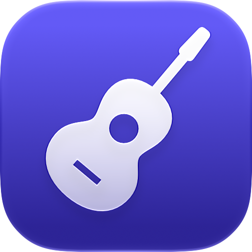
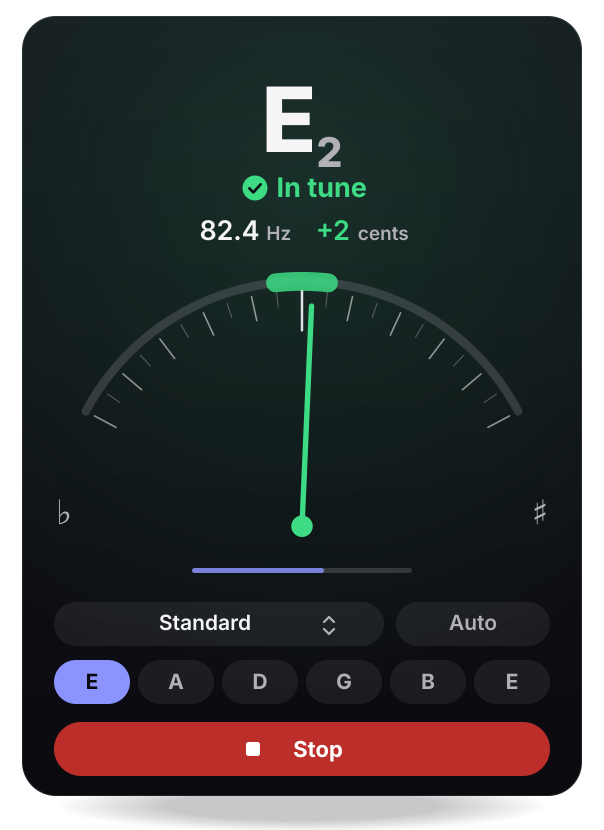

<div align="center">



# ChitarraTune

**A precise, private guitar tuner for Mac, iPhone and iPad.**<br>
<sub>Accordatore per chitarra preciso e privato per Mac, iPhone e iPad.</sub>

<br>

[Features](#features) · [Tunings](#tunings) · [Accuracy](#accuracy) · [Privacy](#privacy-and-security) · [Siri & Shortcuts](#siri-and-shortcuts) · [Install](#install) · [Build](#build-from-source) · [Italiano](#italiano)

<br>

<!-- app-store-badges:en:start -->
<!-- Official App Store badges: Scripts/app-store-badges.sh <App Store ID> adds them once the app is live. -->
<!-- app-store-badges:en:end -->

<p>
  <a href="https://github.com/gpicchiarelli/ChitarraTune/actions/workflows/ci.yml"></a>
  <a href="https://github.com/gpicchiarelli/ChitarraTune/actions/workflows/codeql.yml"></a>
  
  
  
  
  <a href="LICENSE"></a>
</p>

<br>



</div>

<br>

> [!NOTE]
> **Version 2.0** is a ground-up rewrite for macOS 26, iOS 26 and iPadOS 26. It is not released yet: it will be free on the App Store, as an unlisted app reachable only through its direct link, and on the Mac also as a notarized disk image on the [releases page](https://github.com/gpicchiarelli/ChitarraTune/releases). What is left before release is tracked in [docs/RELEASE_READINESS.md](docs/RELEASE_READINESS.md).

<table>
  <tr>
    <td width="33%" valign="top">
      <h3>Precise</h3>
      Measures the fundamental of the string itself, so the sharp overtones of steel strings do not pull the reading. "In tune" lights up only once the note has settled.
    </td>
    <td width="33%" valign="top">
      <h3>Private</h3>
      Sound is analyzed on the device and discarded a fraction of a second later. No recording, no network access, no third-party code.
    </td>
    <td width="33%" valign="top">
      <h3>At home on every device</h3>
      One app for Mac, iPhone and iPad, with Siri, Shortcuts, keyboard shortcuts, VoiceOver and Dynamic Type.
    </td>
  </tr>
</table>

## Features

- **Ten tunings**, with automatic string detection or a string you pin yourself.
- **Reference pitch** from 415 to 466 Hz: baroque pitch, 432 Hz, or a piano that has drifted.
- **Note names** in English (`C D E F G A B`) or fixed-do solfège (`Do Re Mi Fa Sol La Si`); *Automatic* follows your language.
- **Dial or bar**, with a green zone of ±5 cents.
- **Any input on the Mac**, a microphone or an audio interface, plugged in while you tune; one tuner per window, each with its own input and tuning.
- **Soft sources** such as an amplifier at low volume are heard without raising the input gain: the tuner learns how quiet your room is.
- **Considerate:** it slows its analysis in Low Power Mode, stops after a period of silence, and releases the microphone the moment you stop.
- **Accessible:** VoiceOver speaks notes as words and announces when a string is in tune; Dynamic Type up to the largest sizes, Reduce Motion, Increase Contrast and full keyboard control.

## Tunings

| Tuning | Strings, low to high |
| :-- | :-- |
| Standard | E · A · D · G · B · E |
| Half step down | E♭ · A♭ · D♭ · G♭ · B♭ · E♭ |
| Full step down | D · G · C · F · A · D |
| Drop D | D · A · D · G · B · E |
| Drop C | C · G · C · F · A · D |
| DADGAD | D · A · D · G · A · D |
| Open D | D · A · D · F♯ · A · D |
| Open G | D · G · D · G · B · D |
| Open E | E · B · E · G♯ · B · E |
| Open A | E · A · E · A · C♯ · E |

## Accuracy

On 132 reference signals, every string of every tuning, the median error is **0.16 cent** and the worst note is off by half a cent. On modeled real-world conditions (a pickup into an interface, an acoustic guitar in front of a phone, mains hum, Low Power Mode) the typical error stays between 0.3 and 0.4 cent. Every one of these numbers is a test that runs on every push; the method and the limits are in [docs/ACCURACY.md](docs/ACCURACY.md).

## Privacy and security

ChitarraTune listens to your guitar to measure its pitch, and that is all it does with the microphone.

- **Nothing leaves the device.** Sound lives only in the analysis window and is overwritten as new audio arrives. It is never recorded, stored or sent, in any build.
- **No network.** No networking code, and the sandbox has no network entitlement.
- **Least privilege.** App Sandbox with a single resource: audio input. Hardened Runtime, Enhanced Security and pointer authentication.
- **Nothing to inherit.** No third-party dependencies; every GitHub Action is pinned to a commit.
- **A privacy manifest** declares no tracking and no collected data.

Each of these is a [binding decision](docs/adr/README.md) that a test enforces. The policy is in [PRIVACY.md](PRIVACY.md); to report a vulnerability privately, see [SECURITY.md](SECURITY.md).

## Siri and Shortcuts

| Action | What it does |
| :-- | :-- |
| **Start tuning** | Opens the app and starts listening (a microphone needs the foreground) |
| **Stop tuning** | Stops listening |
| **Set tuning** | Chooses one of the ten tunings |
| **Set reference pitch** | Sets A4, 415–466 Hz |
| **Pick a string** | Pins string 1–6, or returns to automatic |
| **Choose input** | Selects a microphone or interface |

Say *"Start tuning in ChitarraTune"*, or use the actions in your own shortcuts. The **Start Tuning** control fits in Control Center, on the Lock Screen and on the Action Button (iPhone, iPad), and in Control Center or the menu bar (Mac).

**Keyboard on the Mac:** <kbd>⌘</kbd> <kbd>L</kbd> start or stop · <kbd>⌘</kbd> <kbd>0</kbd> automatic string · <kbd>⌘</kbd> <kbd>1</kbd>…<kbd>6</kbd> pin a string · <kbd>⌘</kbd> <kbd>N</kbd> new tuner window · <kbd>⌘</kbd> <kbd>,</kbd> Settings.

## Install

Requires **macOS 26**, **iOS 26** or **iPadOS 26**.

- **iPhone, iPad and Mac:** the App Store, free (from 2.0).
- **Mac, outside the store:** download `ChitarraTune-<version>.dmg` from the [releases page](https://github.com/gpicchiarelli/ChitarraTune/releases), open it and drag **ChitarraTune** onto **Applications**. The disk image and the app are both signed, notarized and stapled, so macOS opens them without a warning, even offline.

To check a download before opening it:

```bash
shasum -a 256 -c ChitarraTune-<version>.dmg.sha256
spctl --assess --type open --context context:primary-signature -v ChitarraTune-<version>.dmg
```

## Build from source

You need **Xcode 26** or later.

```bash
git clone https://github.com/gpicchiarelli/ChitarraTune.git
cd ChitarraTune
open ChitarraTune.xcodeproj
```

Choose the **ChitarraTune** scheme and a destination, then run. To sign with your own team, create `Config/Local.xcconfig` (ignored by git) containing `DEVELOPMENT_TEAM = YOURTEAMID`.

The engine and its tests need neither a microphone nor a simulator:

```bash
swift test --package-path Packages/ChitarraTuneKit
Scripts/verify.sh            # everything the pre-push hook checks: lint, warnings, tests, coverage
```

The code is a local Swift package under a thin SwiftUI app:

| Layer | What it does |
| :-- | :-- |
| **TunerCore** | Pitch math, tunings, the YIN detector and the tuning engine. Pure Swift, no I/O. |
| **TunerAudio** | Microphone capture, permission and input discovery, behind protocols. |
| **TunerFeature** | The observable state the interface renders, and the preferences. |
| **App** | SwiftUI screens, menu commands, Settings and App Intents. |

The design is in [docs/ARCHITECTURE.md](docs/ARCHITECTURE.md); every document is listed in [docs/README.md](docs/README.md).

## Contributing

Issues and pull requests are welcome, in English or Italian. [CONTRIBUTING.md](CONTRIBUTING.md) lists the few rules that keep the app small, private and precise. Bugs and ideas go through the [issue forms](https://github.com/gpicchiarelli/ChitarraTune/issues/new/choose); questions about using the app, to [SUPPORT.md](SUPPORT.md).

## License

BSD 3-Clause, © 2025–2026 ChitarraTune contributors. See [LICENSE](LICENSE) and [CONTRIBUTORS.md](CONTRIBUTORS.md).

<sub>Apple, the Apple logo, Mac, macOS, iOS, iPadOS, iPhone, iPad, Xcode, Siri and Shortcuts are trademarks of Apple Inc., registered in the U.S. and other countries and regions. App Store and Mac App Store are service marks of Apple Inc. Swift and the Swift logo are trademarks of Apple Inc. ChitarraTune is an independent project, not affiliated with or endorsed by Apple.</sub>

<br>

## Italiano

<details>
<summary><b>Leggi in italiano</b></summary>

<br>

**ChitarraTune** è un accordatore per chitarra per **Mac, iPhone e iPad**. Misura la fondamentale della corda stessa, così gli armonici crescenti delle corde in acciaio non falsano la lettura, e dice «intonata» solo quando la nota si è davvero stabilizzata.

> [!NOTE]
> **La versione 2.0** è una riscrittura completa per macOS 26, iOS 26 e iPadOS 26, non ancora pubblicata. Sarà gratuita sull'App Store, come app non in elenco raggiungibile solo dal suo link diretto, e per Mac anche come immagine disco autenticata da Apple nella [pagina delle release](https://github.com/gpicchiarelli/ChitarraTune/releases).

<!-- app-store-badges:it:start -->
<!-- Official App Store badges: Scripts/app-store-badges.sh <App Store ID> adds them once the app is live. -->
<!-- app-store-badges:it:end -->

**Caratteristiche**

- Dieci accordature, con riconoscimento automatico della corda o corda fissata a mano.
- La di riferimento (A4) da 415 a 466 Hz.
- Nomi delle note in solfeggio o in inglese; *Automatica* segue la lingua del sistema.
- Quadrante o barra, con zona verde di ±5 cent.
- Sul Mac qualsiasi microfono o interfaccia audio, anche collegata mentre accordi; una finestra per ogni accordatore.
- Sente anche le sorgenti deboli, come un amplificatore a volume basso, senza alzare il guadagno.
- Rallenta l'analisi in Risparmio energetico e si ferma dopo un periodo di silenzio.
- VoiceOver, Dynamic Type, Riduci movimento, Aumenta contrasto e controllo completo da tastiera.
- Siri e Comandi Rapidi: avvia e ferma l'accordatura, scegli accordatura, corda, ingresso e La di riferimento.

**Precisione.** Sui 132 segnali di riferimento l'errore mediano è di 0,16 cent; nelle condizioni realistiche simulate resta tra 0,3 e 0,4 cent. Metodo e limiti in [docs/ACCURACY.md](docs/ACCURACY.md).

**Privacy.** Il suono è analizzato sul dispositivo e scartato dopo una frazione di secondo: non viene mai registrato né inviato. L'app non ha accesso alla rete e non contiene codice di terze parti. Informativa in [PRIVACY.md](PRIVACY.md); per segnalare una vulnerabilità in privato vedi [SECURITY.md](SECURITY.md).

**Installare su Mac.** Scarica `ChitarraTune-<versione>.dmg` dalla [pagina delle release](https://github.com/gpicchiarelli/ChitarraTune/releases), aprilo e trascina **ChitarraTune** su **Applicazioni**. Immagine disco e app sono firmate e autenticate da Apple: si aprono senza avvisi, anche offline.

**Compilare.** Serve Xcode 26 o successivo. Apri `ChitarraTune.xcodeproj`, scegli lo schema **ChitarraTune** e una destinazione. Per firmare con il tuo team crea `Config/Local.xcconfig` con `DEVELOPMENT_TEAM = TUOTEAMID`. I test del motore non richiedono microfono: `swift test --package-path Packages/ChitarraTuneKit`.

**Assistenza.** [SUPPORT.md](SUPPORT.md), in italiano o in inglese.

**Licenza.** BSD 3-Clause, © 2025–2026 ChitarraTune contributors.

</details>
